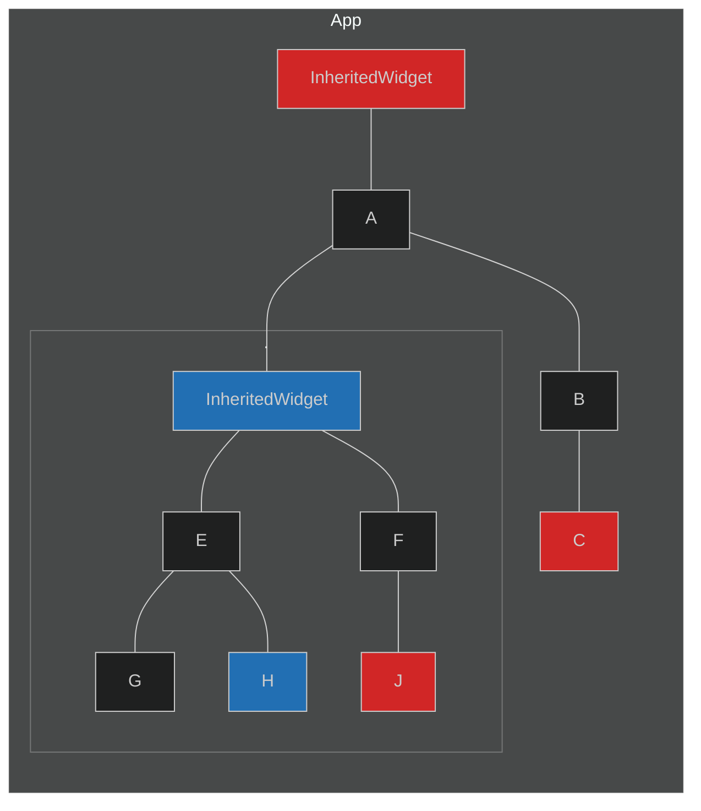

# State Management

The UI's task is to represent state in a presentable format. By managing state effectively, we can update the UI and data in an elegant manner.

Suppose we are displaying a list of courses available this semester. When the app is fetching data (as seen in [the last module](Module1.md)), we should show a loading spinner to let the user know. When the list is loaded, we remove the loading spinner and display the actual list.
Thus we move from _loading_ to _loaded_ state, and handling this manually without a pattern will be difficult to maintain in the long run. We have already seen a way to handle this, using ["State lifting".](/Week-1/module3)

## State revisited

The state that we manage can be dvidied into two types:

### Ephemeral State

Ephemeral state is the state you can store in a single widget. No other widget needs to access this widget's data. Examples include a `TabBarView`, where the tab selected is the ephemeral data.

No state management is required here, just a `Stateful` Widget and `setState` does the job.

### App state

State that we want to share in many parts of the app, and keep between user sessions is called the application state or shared state. Example can be the theme mode of an app (dark or light), notifications, user settings etc. Here is where we need one of the state management solutions, of which we shall explore a few in this module.
[!ref target="blank" text="More about state"](https://stackoverflow.com/questions/68895526/whats-a-state-in-flutter)

[!ref target="blank" text="State management options"](https://docs.flutter.dev/development/data-and-backend/state-mgmt/options)
Let's move on to one of the many patterns for state management.

## Inherited Widget

The `InheritedWidget` is a built in class that allows its child widgets to access its data. It is immutable, hence all fields are final, but any other widget under this can access those fields.

For example, consider this widget tree:

<style>
  .diagram pre, .diagram > div{
    background: #1e1e1e !important;
  }
</style>

:::diagram



There are two inherited widgets (red and blue). Widgets `C` and `J` use the data from the red one while `H` uses data from the blue one. There is no need to pass down the variables through constructors.
:::

Read and watch these links for details about the implementations:
[!ref target="blank" text="Widgets 101"](https://www.youtube.com/watch?v=Zbm3hjPjQMk)

[!ref target="blank" text="Inherited widget"](https://docs.flutter.dev/development/data-and-backend/state-mgmt/options#inheritedwidget--inheritedmodel)
[!ref target="blank" text="Using it"](https://stackoverflow.com/questions/49491860/flutter-how-to-correctly-use-an-inherited-widget)

## Provider package

The `scoped_model` was built on top of the `InheritedWidget` to separate UI and data, but Google recommended using the Provider package instead from 2018.

[Provider](https://pub.dev/packages/provider) is a wrapper around the `InheritedWidget` and simplifies the process.

### Classes used

These are the common classes used in Provider:
`ChangeNotifierProvider`, `Consumer`, `FutureProvider`, `StreamProvider`, and `MultiProvider`.
`ChangeNotifier` is an essential class built in the Flutter SDK.

### Using Provider

Let us now use the Provider package to build the counter app that Flutter comes with.

Since the counter is the data, create a class called `CounterModel` that stores this state.

```dart !#5,9 counter_model.dart
class CounterModel with ChangeNotifier {
  int _counter = 0;
  void increment(){
    _counter++;
    notifyListeners();
  }
  void decrement(){
    _counter--;
    notifyListeners();
  }
  int get count => _counter;
}
```

All logic is now in this `ChangeNotifier` class. `notifyListeners` is used instead of `setState()` to update the state.

We now link this to the UI:

1. Using the `ChangeNotifierProvider` widget, create an instance of the class so the subtree can use it:

```dart !#9-11 main.dart
void main(){
  runApp(const MyApp());
}
class MyApp extends StatelessWidget {
  const MyApp();

  @override
  Widget build(BuildContext context){
    return ChangeNotifierProvider(
      create: (context) => CounterModel(),
      child: const SomePage(),
    )
  }
}
```

The `ChangeNotifierProvider` now exposes this instance of `CounterModel` to all widgets in `SomePage`.

2. Get the value from `MyApp` widget by using `Provider.of<T>(context)` method.

```dart !#6 some_page.dart
class SomePage extends StatelessWidget {
  const SomePage();

  @override
  Widget build(BuildContext context) {
    final counter = Provider.of<CounterModel>(context);
    return Scaffold(
      ...
    );
  }
}
```

Now to increment the counter, use `counter.increment`.

```dart !#3,5,8 some_page.dart
FlatButton(
  child: const Text("+1"),
  onPressed: () => counter.increment();
),
Text("${counter.count}"),
FlatButton(
  child: const Text("-1"),
  onPressed: counter.decrement,
)
```

When the `increment` method is called, it calls `notifyListeners`. Since `SomePage` is a _listener_ (it is a child of `ChangeNotifierProvider`), it is listening to changes and rebuilds.

!!!
Instead of `Provider.of<T>(context)`, we can use `context.read<T>()` or `context.watch<T>()`.

More info
!!!

#### Consumer

The `Provider.of<T>(context)` method can only be used in the subtree of the `ChangeNotifierProvider`. An exception occurs otherwise, because there's no matching Provider above.

```dart
class Page extends StatelessWidget {
  @override
  Widget build(BuildContext context) {
    return Provider<SomeModel>(
      create: (_) => SomeModel(),
      child: Text(
        "${Provider.of<SomeModel>(context).title}"
      )
    )
  }
}
```

> `Provider`, as opposed to `ChangeNotifierProvider` only supports reading of the provided value. The widgets are not rebuilt.
> This won't work, as both the `Provider` and `Provider.of` are at the same level of `Provider`. There are two ways to solve this problem:

1. Introduce a BuildContext one level below the `Provider`. This can be done by creating a dummy widget and extracting the child to this widget.
   By wrapping the code that uses `Provider.of` in another widget, we can also use the `const` constructor.

```dart
Provider<SomeModel>(
  create: (_) => SomeModel(),
  child: WrapperWidget();
)
//In the WrapperWidget
Widget build(BuildContext context){
  final title = Provider.of<SomeModel>(context).title;
  return Widget(...);//use title here
}
```

2. Use the `Consumer<T>` class that automatically obtains the value.

```dart
class Page extends StatelessWidget {
  @Override
  Widget build(BuildContext context) {
    return Provider<SomeModel>(
      create: (_) => SomeModel(),
      child: Consumer<SomeModel>(
        builder: (_, value, __) {
          return Text(
              "${Provider.of<SomeModel>(context, listen: false).title}"
            );
        }
      )
    );
  }
}
```

!!! Unnecessary rebuilds
The associated widget is rebuilt everytime the Provided instance calls `NotifyListeners`. If you are using using `Provider` to just pass on a cache object down the tree, use `Provider.of<T>(context, listen: false)` to not trigger a rebuild of the widget.

This is also used when the value is need outside the widget tree, where there is nothing to rebuild.

```dart !#2
void doSomething(BuildContext context){
  final data = Provider.of<SomeModel>(context, listen: false).data;
  ...
}
```

Or, we can use `context.read` as well.

```dart !#2
void doSomething(BuildContext context){
  final data = context.read<SomeModel>().data;
  ...
}
```

!!!
Read more about using these methods and classes and also the good practices on the official documentation.
[!ref target="blank" text="On pub.dev"](https://pub.dev/packages/provider)

[!ref target="blank" text="On Flutter"](https://docs.flutter.dev/development/data-and-backend/state-mgmt/simple)

There are many more state manangement libraries like Redux, BLoC, RiverPod, each having their advantages. In this summer group we will stick to Provider, and I think you are armed enough to explore the rest :)
